<div align="center">

# 📊 Telecom Customer Churn Prediction & Retention Dashboard

**End-to-end Machine Learning project | Random Forest + SHAP | Interactive Streamlit Dashboard**

[](https://www.python.org/)
[](https://scikit-learn.org/)
[](https://streamlit.io/)
[](https://shap.readthedocs.io/)
[]()

**[🔗 Live Dashboard](https://ibm-customer-churn-project-dashboard-mj30.streamlit.app/)**

</div>

---

## 📋 Table of Contents

- [Project Overview](#-project-overview)
- [Key Business Findings](#-key-business-findings)
- [Technical Architecture](#%EF%B8%8F-technical-architecture)
- [Tech Stack](#-tech-stack)
- [Exploratory Data Analysis](#-exploratory-data-analysis)
- [Customer Segmentation (RFM)](#-customer-segmentation-rfm)
- [Churn Prediction Model](#-churn-prediction-model)
- [Model Explainability with SHAP](#-model-explainability-with-shap)
- [Business Recommendations](#-business-recommendations)
- [Interactive Dashboard Features](#-interactive-dashboard-features)
- [How to Run Locally](#%EF%B8%8F-how-to-run-locally)
- [Project Structure](#-project-structure)
- [Future Work](#-future-work)

---

## 🎯 Project Overview

This project builds a complete data science pipeline for a telecom company to **predict customer churn** and **drive retention decisions**. The workflow covers the full lifecycle — from raw data ingestion, exploratory analysis, customer segmentation, and machine learning modeling, to an interactive dashboard deployed with Streamlit and SHAP explainability.

**Dataset:** IBM Telco Customer Churn — 7,043 customers, 50+ attributes across demographics, account info, services, and churn status.

**Core Problem:** The company loses **26.5% of customers annually**. At-risk customers represent **$3.6M in revenue**. The goal is to identify who will churn, understand why, and recommend targeted retention actions.

**What this project delivers:**

| Capability | Description |
|---|---|
| **Churn Prediction** | Random Forest model with 91% recall, 93% precision |
| **Customer Segmentation** | 4 RFM tiers (Champions → Lost) with distinct churn profiles |
| **What-If Simulation** | Modify attributes interactively and see updated predictions |
| **Explainability** | SHAP waterfall plots showing why each customer is at risk |
| **Deployed Dashboard** | Live Streamlit app accessible via browser |

---

## 📈 Key Business Findings

| Metric | Value |
|---|---|
| Total Customers | 7,043 |
| Overall Churn Rate | **26.5%** |
| At-Risk Customers (Probability > 0.5) | **1,861** |
| Revenue at Risk | **$3,615,466** |
| Model Recall (Churners Identified) | **91%** |
| Top Churn Driver | **Customer Satisfaction** |

### Churn Rate by Customer Segment

| Segment | Customers | Churn Rate | Avg Revenue | Strategy |
|---|---|---|---|---|
| 🟢 Champions | 1,395 | **6.5%** | $6,570 | Protect — no aggressive targeting |
| 🔵 Loyal Customers | 2,384 | **18.4%** | $4,009 | Monitor — maintain engagement |
| 🟠 At Risk | 1,527 | **30.1%** | $1,405 | **Primary retention target** |
| 🔴 Lost | 1,737 | **50.6%** | $288 | Low ROI — do not prioritize |

**Key Insight:** The **At Risk** segment (1,527 customers) offers the best retention ROI — high enough churn risk to justify intervention, with sufficient remaining revenue to make retention economically viable.

---

## 🏗️ Technical Architecture

```
                        ┌─────────────────┐
                        │   Raw Data (6    │
                        │   Excel Files)   │
                        └────────┬────────┘
                                 │
                                 ▼
                        ┌─────────────────┐
                        │  Data Merge &    │
                        │   Cleaning       │
                        │ (master_df.csv)  │
                        └────────┬────────┘
                                 │
                   ┌─────────────┼─────────────┐
                   ▼             ▼             ▼
          ┌────────────┐ ┌────────────┐ ┌────────────┐
          │ Notebook 02│ │ Notebook 03│ │ Notebook 04│
          │    EDA     │ │    RFM     │ │   Churn    │
          │            │ │ Segmentation│ │ Prediction │
          └────────────┘ └────────────┘ └────────────┘
                                                   │
                                                   ▼
                                        ┌────────────────────┐
                                        │  Random Forest     │
                                        │  47 features       │
                                        │  class_weight=balanced│
                                        └────────┬───────────┘
                                                 │
                               ┌─────────────────┼─────────────────┐
                               ▼                 ▼                 ▼
                    ┌────────────────┐ ┌────────────────┐ ┌────────────────┐
                    │ Churn          │ │ SHAP           │ │ Encoding       │
                    │ Probabilities  │ │ TreeExplainer  │ │ Config +       │
                    │ (predictions)  │ │ (explainability)│ │ Feature Names  │
                    └────────────────┘ └────────────────┘ └────────────────┘
                               │                 │                 │
                               └─────────────────┼─────────────────┘
                                                 ▼
                                        ┌────────────────────┐
                                        │   Streamlit App    │
                                        │   (app/app.py)     │
                                        │                    │
                                        │  • KPI Metrics     │
                                        │  • Customer Lookup │
                                        │  • SHAP Waterfall  │
                                        │  • What-If Simulator│
                                        └────────────────────┘
                                                 │
                                                 ▼
                                        ┌────────────────────┐
                                        │   Streamlit Cloud  │
                                        │   (Deployed)       │
                                        └────────────────────┘
```

---

## 🛠️ Tech Stack

| Category | Technology | Purpose |
|---|---|---|
| **Language** | Python 3.11 | Core development |
| **Data Processing** | Pandas, NumPy | Data manipulation, aggregation |
| **Visualization** | Matplotlib, Seaborn | EDA plots, segment analysis |
| **ML Modeling** | scikit-learn 1.9 | Random Forest, Logistic Regression, Gradient Boosting |
| **Explainability** | SHAP 0.51 | TreeExplainer, waterfall plots |
| **Web App** | Streamlit 1.58 | Interactive dashboard |
| **Deployment** | Streamlit Cloud | Live hosting |
| **Version Control** | Git, GitHub | Source management |

---

## 🔍 Exploratory Data Analysis

### Churn Distribution
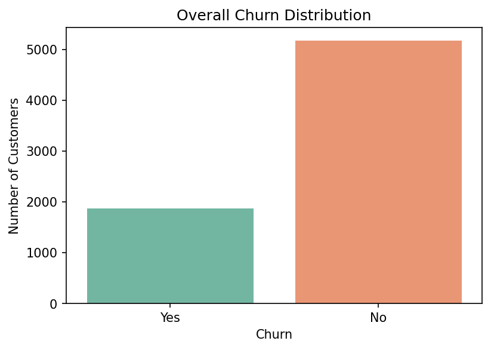

### Churn by Contract Type
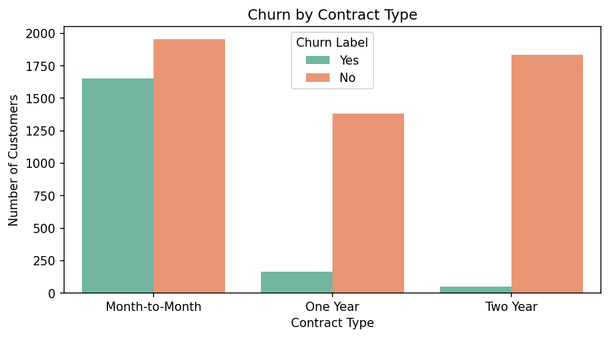

Month-to-month contracts show significantly higher churn compared to one-year and two-year contracts — a key business lever for retention.

### Tenure & Monthly Charge Analysis
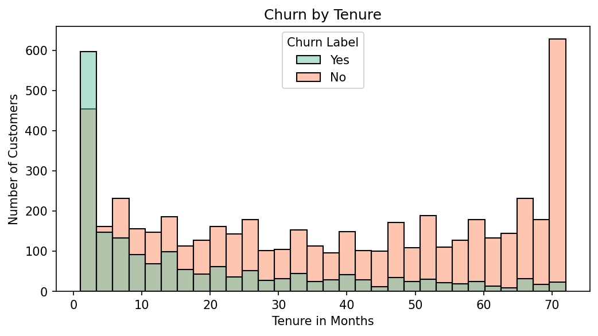
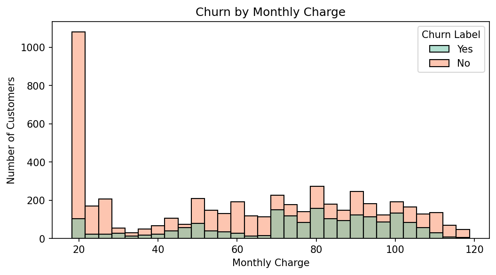

New customers (low tenure) and those with higher monthly charges exhibit elevated churn rates, suggesting early engagement and pricing sensitivity as intervention points.

### Top Churn Reasons
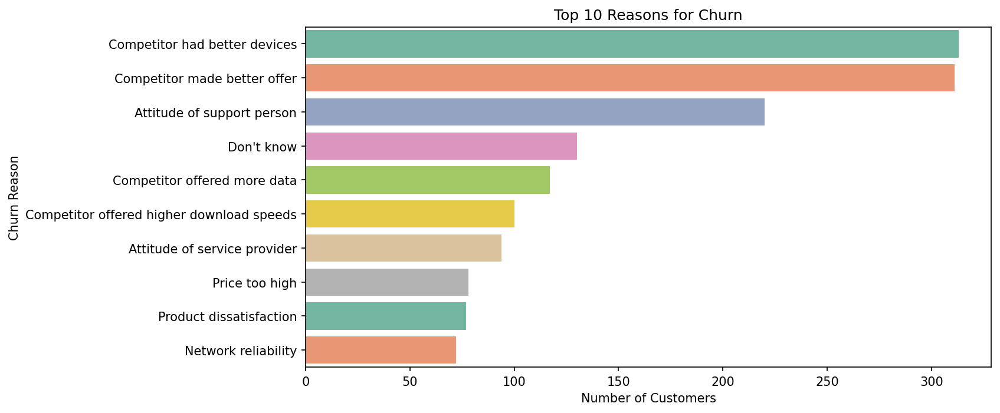

Competitor offers and attitude of support staff dominate churn reasons — indicating both competitive pressure and service quality issues.

---

## 👥 Customer Segmentation (RFM)

Since traditional RFM (Recency, Frequency, Monetary) is designed for transactional data, I adapted the framework for telecom:

| Component | Proxy Metric | Rationale |
|---|---|---|
| **R**ecency | Tenure in Months | Longer tenure = more recent engagement |
| **F**requency | Number of Referrals | Active engagement signal |
| **M**onetary | Total Revenue | Direct value measurement |

### Customer Segments Distribution
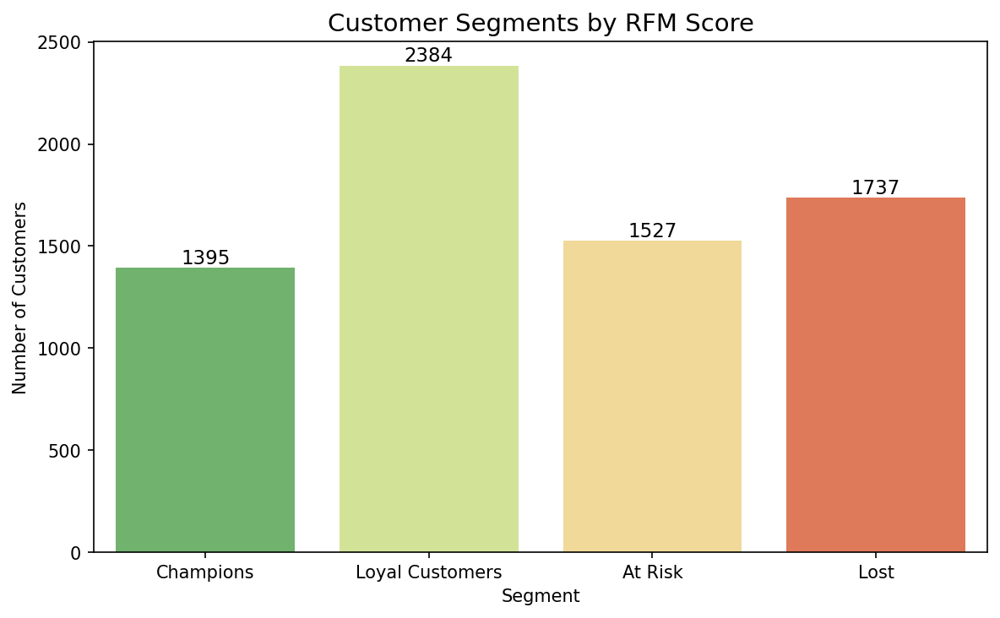

### Churn Rate by Segment
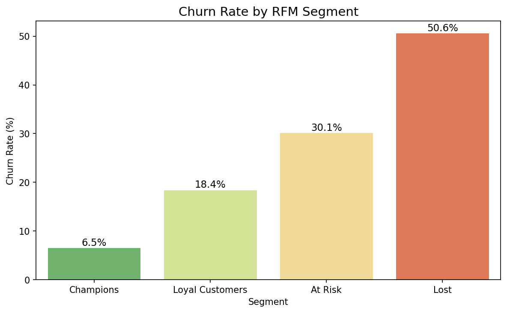

### Average Revenue by Segment
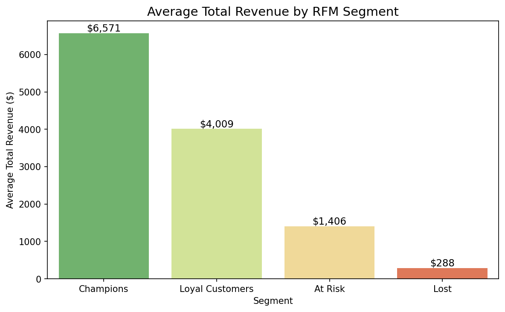

---

## 🤖 Churn Prediction Model

### Model Comparison

| Model | Recall | Precision | F1 Score | Decision |
|---|---|---|---|---|
| Logistic Regression | 0.93 | 0.85 | 0.89 | ❌ Too many false alarms |
| **Random Forest** | **0.91** | **0.93** | **0.92** | **✅ Selected** |
| Gradient Boosting | 0.89 | 0.97 | 0.93 | ❌ Misses too many churners |

**Why Random Forest:**
- Best balance of recall (finding churners) and precision (minimizing false positives)
- Robust to outliers and non-linear relationships
- Provides native feature importance scores
- Handles class imbalance via `class_weight='balanced'`

### Confusion Matrix
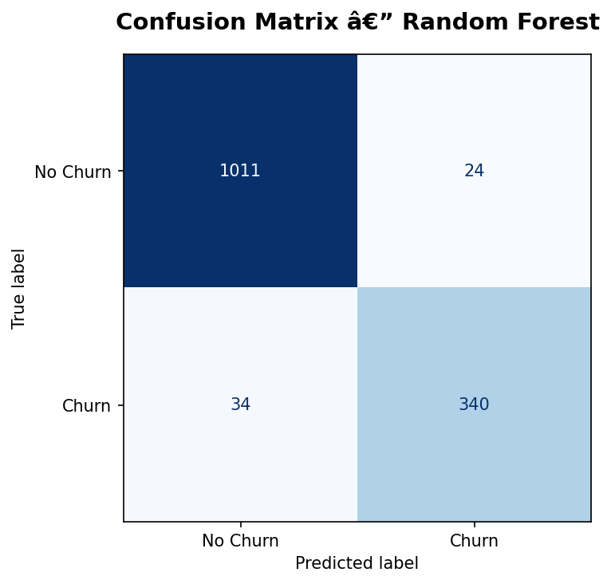

- **True Negatives:** 1,011 — correctly identified retained customers
- **True Positives:** 340 — correctly identified churners
- **False Negatives:** 34 — churners missed (acceptable business cost: 8% miss rate)
- **False Positives:** 24 — false alarms (low — retention team resources not wasted)

### Feature Importance
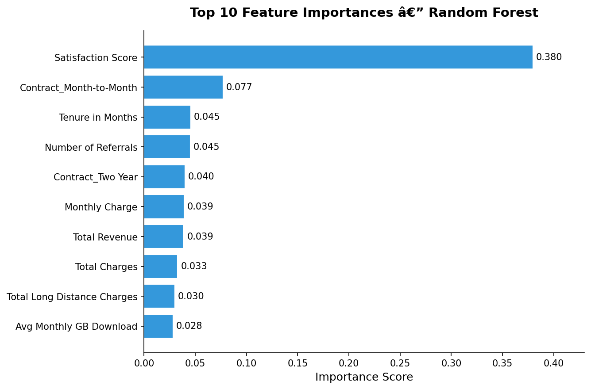

**Top 5 Drivers of Churn:**

| Rank | Feature | Importance |
|---|---|---|
| 1 | **Satisfaction Score** | 0.380 |
| 2 | **Contract (Month-to-Month)** | 0.077 |
| 3 | **Tenure in Months** | 0.045 |
| 4 | **Number of Referrals** | 0.045 |
| 5 | **Contract (Two Year)** | 0.040 |

**Primary Insight:** Customer satisfaction is the dominant churn driver at **3.8× the impact** of the next feature. Churn is fundamentally an experience problem, not a pricing or demographic one.

---

## 🔮 Model Explainability with SHAP

SHAP (SHapley Additive exPlanations) provides per-customer interpretability by showing how each feature contributes to the predicted churn probability. This transforms the model from a black box into an actionable diagnostic tool.

### Global Feature Impact (Beeswarm Summary)
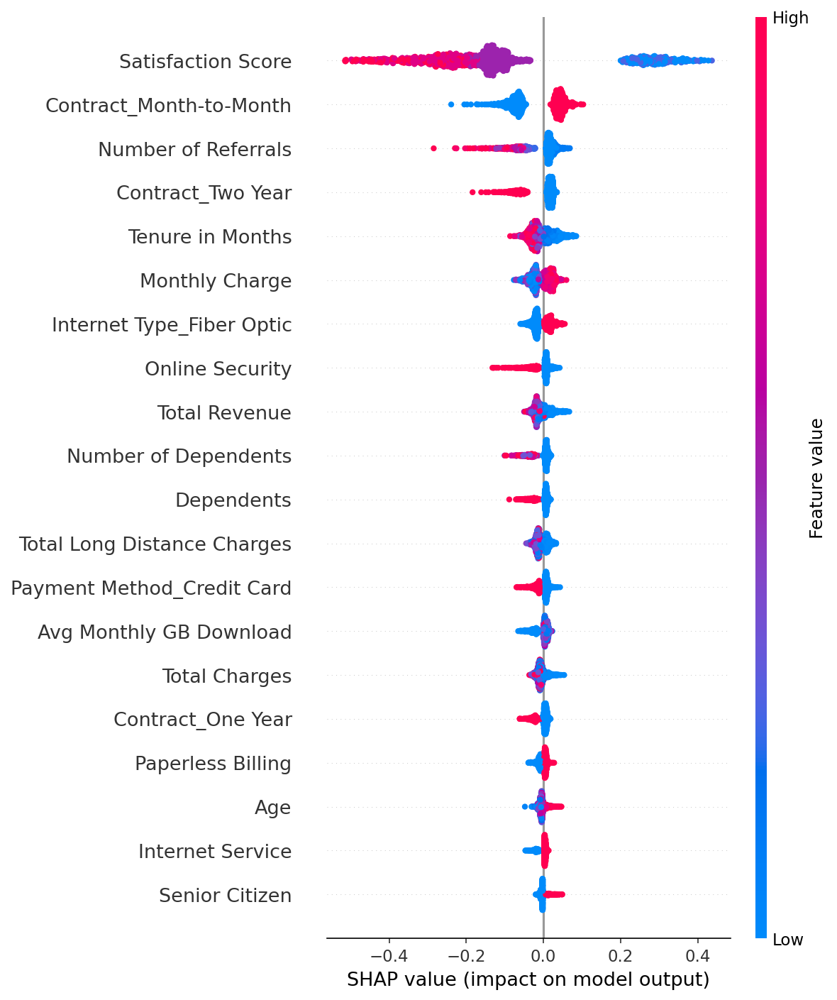

### Per-Customer Waterfall Explanation
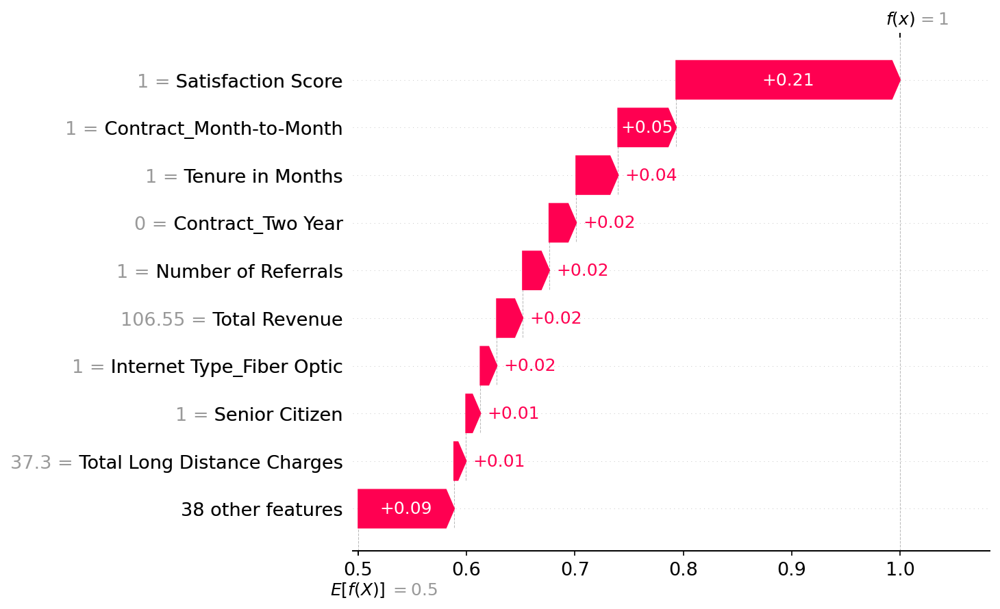

Each customer's waterfall plot shows:
- **Base value:** Average churn probability across all customers (~26.5%)
- **Red bars:** Features pushing the prediction toward churn
- **Blue bars:** Features pushing the prediction toward retention
- **Final value:** This customer's predicted churn probability

---

## 💼 Business Recommendations

### 1. Prioritize the At-Risk Segment
The **1,527 At Risk customers** (30.1% churn rate, $1,405 avg revenue) represent the optimal retention target. They are valuable enough to retain and risky enough to justify intervention.

### 2. Address Satisfaction First
Satisfaction Score dominates the model (38% feature importance). Implement:
- Real-time satisfaction monitoring (post-call surveys, NPS tracking)
- Proactive outreach for customers with scores ≤ 2
- Root cause analysis for low satisfaction drivers

### 3. Convert Month-to-Month Contracts
Month-to-month contracts are the second strongest churn predictor. Offer:
- Discounted upgrades to annual contracts
- Loyalty rewards for completing 6 months
- Auto-renewal incentives

### 4. Early Tenure Intervention
Churn risk is highest in the first 6 months. Implement:
- 30-day welcome call / onboarding check
- 90-day value realization review
- Personalized usage tips based on service profile

### 5. Leverage Referral Programs
Number of referrals correlates with retention. Encourage referrals:
- Double referral rewards for first 3 months
- Gamified referral leaderboards
- Referral-based loyalty tiers

---

## 🖥️ Interactive Dashboard Features

The deployed Streamlit dashboard ([live link](https://ibm-customer-churn-project-dashboard-mj30.streamlit.app/)) provides:

| Feature | Description |
|---|---|
| **KPI Metrics** | Total customers, churn rate, at-risk count, revenue at risk |
| **Customer Lookup** | Search by Customer ID to view churn probability, RFM segment, and profile |
| **SHAP Waterfall** | Per-customer explanation of churn risk drivers |
| **What-If Simulator** | Modify any of 33 customer attributes and instantly see updated predictions + SHAP explanation |

### What-If Simulator Use Case
A retention agent can:
1. Look up a high-risk customer
2. See that their churn risk is driven by low satisfaction + month-to-month contract
3. Simulate: "What if I offer a contract upgrade and a satisfaction improvement?"
4. See the churn probability drop in real time
5. Make a data-driven retention offer

---

## ▶️ How to Run Locally

```bash
# 1. Clone the repository
git clone https://github.com/MujtabaJ30/customer-churn-project.git
cd customer-churn-project

# 2. Create and activate virtual environment
python -m venv venv
# Windows:
venv\Scripts\activate
# macOS/Linux:
# source venv/bin/activate

# 3. Install dependencies
pip install -r requirements.txt

# 4. Launch the dashboard
streamlit run app/app.py
```

### Reproduce Notebooks
```bash
jupyter notebook notebooks/
```
Open notebooks in order: `01_data_exploration → 02_eda → 03_rfm_segmentation → 04_churn_prediction`

---

## 📁 Project Structure

```
customer-churn-project/
│
├── app/                          # Streamlit dashboard application
│   ├── app.py                    # Main entry point (KPI, lookup, SHAP, what-if)
│   └── utils.py                  # Loaders, caching, encoding pipeline
│
├── data/
│   ├── processed/                # Cleaned & enriched datasets
│   │   ├── master_df.csv         # Cleaned merged dataset (50 columns)
│   │   ├── customer_data_with_predictions.csv  # Predictions + RFM + revenue
│   │   └── rfm_segments.csv      # 4 RFM segment labels per customer
│   └── raw/                      # Original IBM Telco source files (6 xlsx)
│
├── models/                       # Serialized artifacts
│   ├── rf_churn_model.pkl        # Trained Random Forest
│   ├── shap_explainer.pkl        # SHAP TreeExplainer
│   ├── feature_names.pkl         # 47 model feature names
│   └── encoding_config.pkl       # Encoding rules for what-if simulator
│
├── notebooks/                    # Jupyter notebooks (execution order)
│   ├── 01_data_exploration.ipynb # Raw data inspection & merge
│   ├── 02_eda.ipynb              # Exploratory data analysis + visualizations
│   ├── 03_rfm_segmentation.ipynb # RFM customer segments
│   ├── 04_churn_prediction.ipynb # Modeling, SHAP, feature importance
│   ├── 05_cltv_analysis.ipynb    # CLTV (placeholder for future work)
│   └── *.png                     # Generated visualizations (16 total)
│
├── venv/                         # Python virtual environment (excluded from git)
├── requirements.txt              # Production dependencies only
├── runtime.txt                   # Python version for Streamlit Cloud
├── implementation_plan.md        # Deployment plan & architecture decisions
├── project_context.md            # Full project documentation & decisions
└── .gitignore
```

---

## 🔮 Future Work

- [ ] **CLTV Prediction** — Model customer lifetime value to refine retention spend limits
- [ ] **A/B Testing Framework** — Design experiments to measure intervention effectiveness
- [ ] **Automated Retraining Pipeline** — Scheduled model retraining with drift detection
- [ ] **Email/SMS Integration** — Trigger automated retention offers via API
- [ ] **Segment-Level Deep Dive** — Build separate models per RFM segment for higher accuracy
- [ ] **Dashboard Authentication** — Role-based access for different stakeholders

---

<div align="center">

**Built with Python, scikit-learn, SHAP & Streamlit**

[🔗 Live Dashboard](https://ibm-customer-churn-project-dashboard-mj30.streamlit.app/) &nbsp;|&nbsp; [📧 Contact](https://github.com/MujtabaJ30)

</div>
